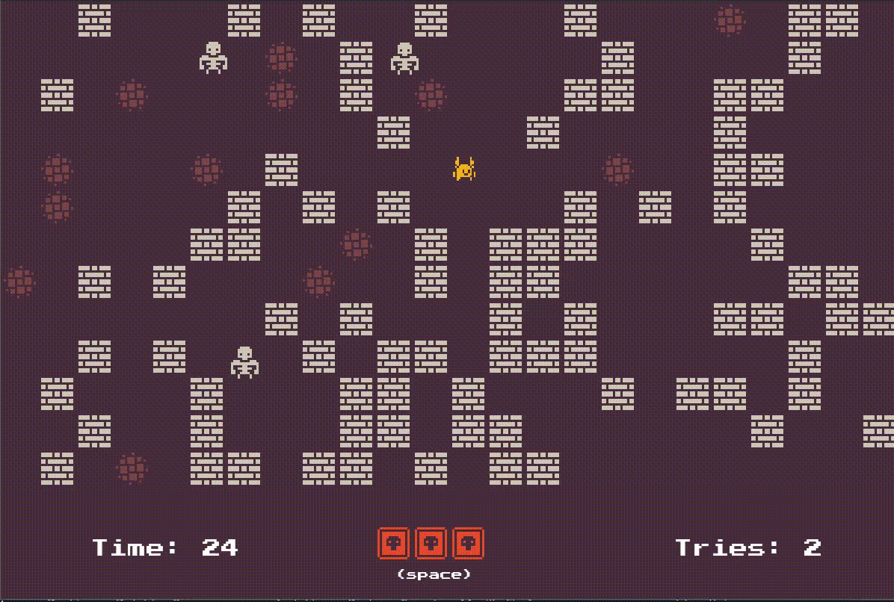
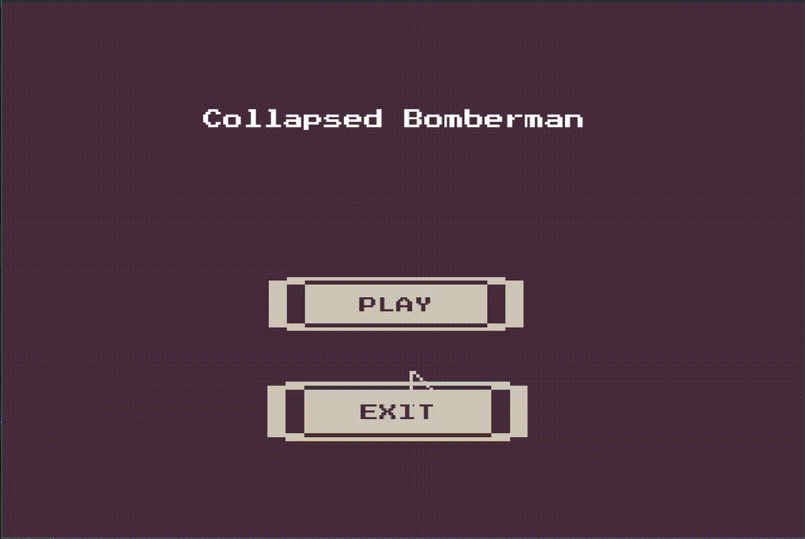
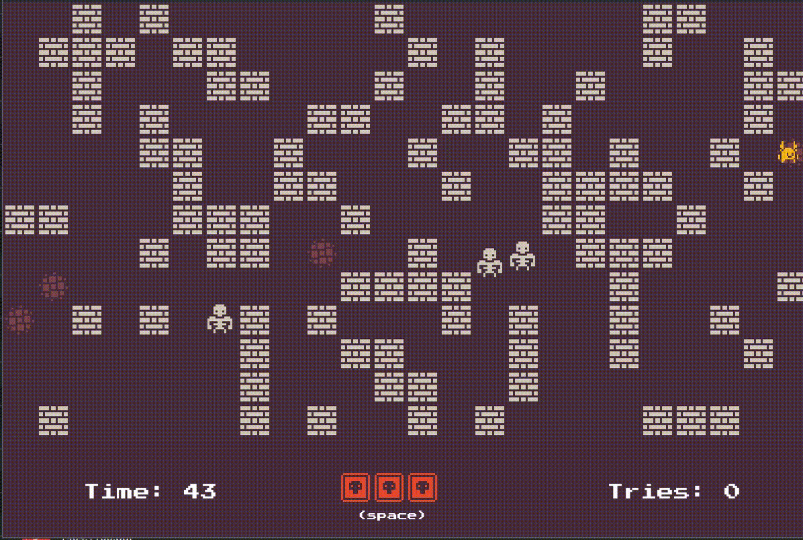

# Collapsed Bomberman

* Collapsed Bomberman was developed as a semestral project for the 
2023 Winter Python class. The goal was to implement a Bomberman-like game with a unique map generation system utilizing the wave function collapse algorithm.
* Gameplay revolves around a simple premise: eliminate all enemies to achieve victory. Players strategically place bombs while navigating the map to outmaneuver enemies.
* The visuals are created using beautifull 1-bit pack assets and the Press2Play font.

<p align="center">
  
</p>

#### Controls:
  - arrows - movement
  - space - blace bomb 


## Development process
The development process can be dissected into two primary components: 
- the construction of the game's core mechanics resembling Bomberman 
- the integration of the map generation algorithm.

### Game Clone
The game implementation utilizes pygame library for low-level functionlities. The game architecture revolves around states. Each state encapsulates a set of game entities which are building blocks of each scene. Entities, interact with the game systems through the draw() and update() functions. Each tick the current state calls its update-draw routine for the associated entities.

### Wave Function collapse
The wave function collapse algorithm plays a pivotal role in procedural map generation. Its main advantage is the ability to produce locally similar outputs to the inputs while remaining greedy. The resulting maps have more "natural feel" without any aditional overhead. This project implements th "simple tile" version of algorithm. The generation rules are generated dynamically from user defined map. Currently the initial map is hardcoded, but more interactive ways of defining the starting map is in plan.

## Features

- Bomberman-like gameplay
- Wave Function collapse map generation
- Configurable gameplay

## Demo

<p align="center">
  
  
</p>

## Requirements

The project requires python3 and additional libraries:
```bash
- pygame~=2.5.2
- scipy~=1.11.4
- numpy~=1.26.1
- pytest~=7.4.3
```
## Run Locally

Clone the project

```bash
  git clone https://link-to-project
```

Go to the project directory

```bash
  cd Collapsed_Bomberman
```

Install dependencies

```bash
  pip install -r requirements.txt
```

Start the game:

```bash
  python main.py
```


# Licences

### 1-Bit Pack (C0 License)

Projekt uses 1-Bit Pack assets from [Kenney.nl](Kenney.nl).
- **License:** [1-Bit Pack C0 License](https://creativecommons.org/publicdomain/zero/1.0/)
- **Source:** [1-Bit Pack on OpenGameArt.org](https://opengameart.org/content/1-bit-pack)

### Press Start 2P Font (Open Font License)

Projekt uses Press Start 2P font from Google Fonts.
- **License:** [Open Font License (OFL)](https://opensource.org/licenses/OFL-1.1)
- **Source:** [Press Start 2P on Google Fonts](https://fonts.google.com/specimen/Press+Start+2P)
